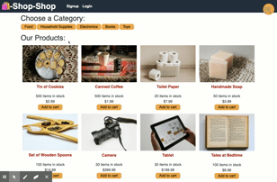

# Shop-Shop-Redux-Store

Refractor e-commerce platform from using global state React's Contect API to Redux.

### Github : https://github.com/sylviaprabudy/redux-store
### Website : https://redux-store-shop.herokuapp.com/


## Description
E-commerce website that allows user to login and purchase items, also see their order history.


## User Story
```
- AS a senior engineer working on an e-commerce platform
- I WANT my platform to use Redux to manage global state instead of the Context API
- SO THAT my website's state management is taken out of the React ecosystem
```

## Usage
- This e-commerce website are sortec by categories.
- Users are able add items from the homepage, category page and product detail page(PDP).
- Users also able to delete item from PDP or cart.
- Users also able to update the quantity of the items in the cart.
- To continue to purchase their items, users must sign up and login.
- Payments are handled by Stripe.
- Once user paid, it will redirect them to the sucess page.
- All the items pruchased will be saved in the history.


## Gif Walkthrough



## Technologies Use
<p><a href="https://redux.js.org/">Redux</a></p>
<p><a href="https://reactjs.org/">React.js</a></p>
<p><a href="https://www.mongodb.com/">MongoDB</a></p>
<p><a href="https://nodejs.org/">Node.js</a></p>


## Contributor:
Sylvia Prabudy ©2020 All Rights Reserved.
- - -